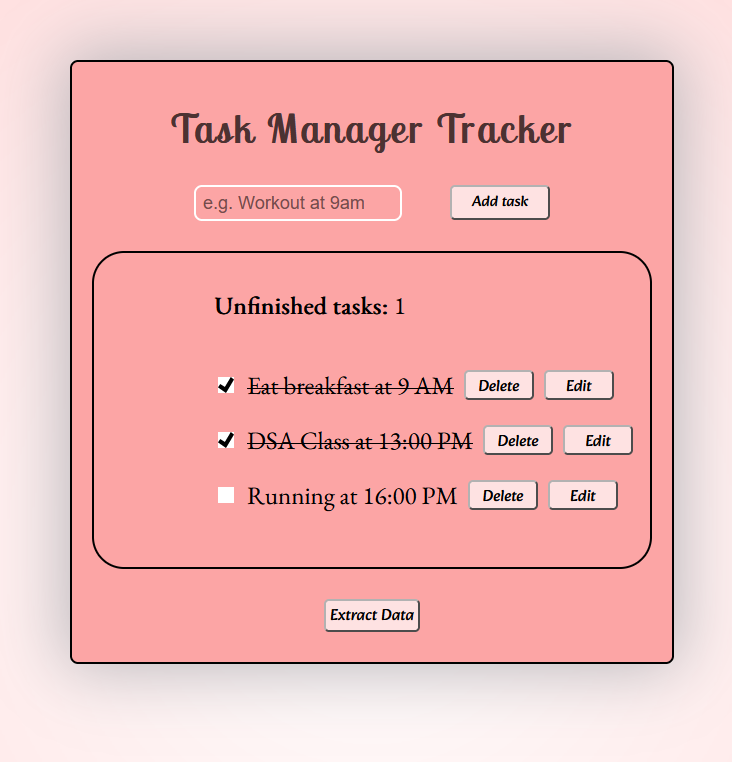

# Project Task-manager app 

The goal of this repo is to practice the following skill sets:

- JavaScript & Testing
  - **DOM**: primary objective of this project
  - Essential methods that I learnt using:
    - `document.createElement`, `addEeventListener`, `append`
  - Selecting methods that were super helpful:
    - `querySelector` & selecting with with document (Id, TagName, Class etc.) 
- Testing using Mocha: `describe`, `assert`,
- How to handle LocalStorage using methods such as: `setItem`, `getItem`, `clear`
- How to configure / download modules
- How to export JSON format locally

## Summary

JavaScript DOM and Testing were the main focus of this project. The project taught me the essentials how to create an interactive website without using any frameworks and it shows why frameworks were implemented in the first place.

I struggled a bit with how events work in the DOM structure and specifially `this` keyword but after a lot of trial and error I understood it finally!

Also the testing was quite difficult to implement since I have never used `LocaleStorage` but rather built-in libraries. I chose `Mocha` since it was easier to be implemented with `localStorage` rather than `Jest` testing library.

I got it to work with a lot of reading how to troubleshoot certain tests and logging their results.


## Links
- [Live Demo](https://frenzy017.github.io/task-manager/) / [Code](https://github.com/Frenzy017/task-manager)

## Screenshots

> Normal View



## Deployment

```sh
git clone https://github.com/Frenzy017/task-manager.git
```
- Cd into the repository
- Open terminal and run:

```sh
npm i node
```

- Then you can open the html file locally or download the live server extension and run it

- Search for:
```sh
live server extension vs code
```
- Download it and then open the index.html file until it shows that it's using localhost port

- You can also try the localStorage test mockup by typing in terminal:
```sh
mocha test.js
```
- Enjoy!
